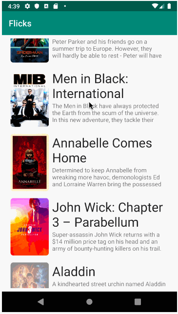

# Project 2 - Flixster

Flixster is an android app that allows users to view a movie list with posters, title, and overview, as well as view individual movie ratings and trailers.

Submitted by: Carolyn Wong

Time spent: 20 hours spent in total

## User Stories

The following **required** functionality is completed:

* [x] User can view a list of movies (title, poster image, and overview) currently playing in theaters from the Movie Database API.

The following **stretch** features are implemented:
* [x] Display a nice default placeholder graphic for each image during loading
* [x] Add rounded corners for the images using the Glide transformations
* [x] Views should be responsive for both landscape/portrait mode
* [x] When a movie is selected, expose details of a movie (ratings using RatingBar, popularity, and synopsis) in a separate activity
* [x] Allow video posts to be played in full-screen using the YouTubePlayerView

The following **additional** features are implemented:

* [x] Added an image placeholder and title text for a recommended movie based on the movie being currently viewed. 
* [ ] In progress on branch 'recommendations-recycler': addition of call to movie API and adapter to display a horizontally scrollable list of movie titles/posters recommended based on the movie being currently viewed.

## Video Walkthrough

Here's a walkthrough of implemented user stories:

GIF created with [LiceCap](http://www.cockos.com/licecap/).

## Notes

Asynchronous calls were confusing at first, but TJ's explanation was very helpful!

## License

    Copyright 2019 Carolyn Wong

    Licensed under the Apache License, Version 2.0 (the "License");
    you may not use this file except in compliance with the License.
    You may obtain a copy of the License at

        http://www.apache.org/licenses/LICENSE-2.0

    Unless required by applicable law or agreed to in writing, software
    distributed under the License is distributed on an "AS IS" BASIS,
    WITHOUT WARRANTIES OR CONDITIONS OF ANY KIND, either express or implied.
    See the License for the specific language governing permissions and
    limitations under the License.
